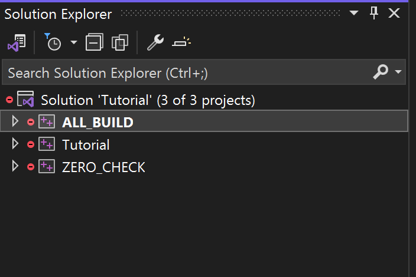

# Introduction to CMakeLists.txt
The `CMakeLists.txt` file serves as the foundational configuration for a CMake project. It contains commands and settings that CMake uses to generate build systems in a platform- and compiler-independent manner.

## Running Your CMake Project
To facilitate the build process, we provide two PowerShell scripts:

* `run-cmake.ps1` - Executes the default project configuration and generates build solutions. These solutions are placed within the **Generated** directory. Simply run: `./run-cmake.ps1`
This script initializes the project setup by creating necessary build files and directories.

* `run-cmake-build.ps1` - Compiles the source files into an executable. It targets the files located in the **Generated** directory.

Also you can quickly run the compiled program using `run-built-program.ps1`.

## Key CMake Commands to Explore
In this lesson, we will focus on three essential CMake commands that are critical for basic project setup:

- `project()` - Specifies the name and version of the project, and optionally sets the programming languages used. It is fundamental for any CMake project as it initiates project configuration.
- `cmake_minimum_required()` - Ensures that a certain minimum version of CMake is used. This is crucial for compatibility and to prevent potential issues with newer CMake features that might not be supported in older versions.
- `add_executable()` - Defines an executable target by specifying the resulting executable name and the source files required to build it. This command is used to compile the source files into an executable binary.
By understanding and using these commands, you can effectively configure and build a simple CMake project.

Let's examine the generated solution:

In addition to the Tutorial project within the solution, there are two other projects that are automatically generated by default: 

* `ZERO_CHECK`
The `ZERO_CHECK` project is created by CMake to ensure that the build system files are up-to-date with the CMakeLists.txt files. Whenever you build your project, ZERO_CHECK runs first to check if any changes have been made to the CMake configuration files (CMakeLists.txt). If changes are detected, `ZERO_CHECK` will automatically re-run CMake to regenerate the build system files, ensuring that your project setup remains consistent with your CMake scripts.

* `ALL_BUILD`
The `ALL_BUILD` project is essentially a virtual project that CMake includes as a convenient way to build all the targets in your solution with a single action. When you build the `ALL_BUILD` project, it triggers the compilation of all defined targets in your project. This is especially useful in complex projects with multiple executables or libraries, as it allows you to rebuild everything from scratch with a single build command.

# What next?
What if I prefer not to include these projects? 
What if I want to introduce different filters into the solution?
How can I designate separate directories for my source files?

[Lesson 2](../lesson-02/lesson-02-readme.md)