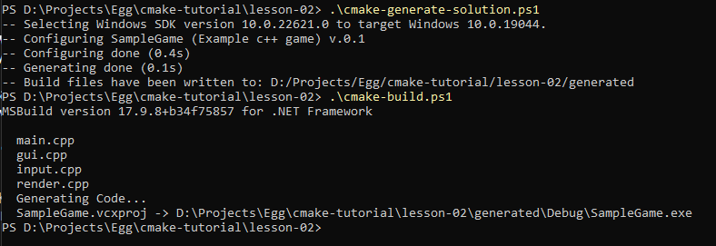
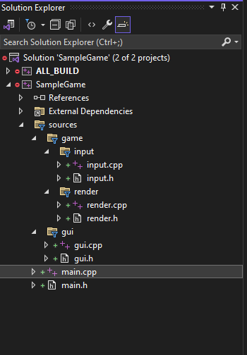

# Project configuration
Imagine you are working on a complex project with files scattered across various directories, and you wish to mirror this file structure in a Visual Studio project. Consider a hypothetical game organized as follows:

~~~
- sources
-- game
---- input
---- render
-- gui
~~~

To achieve this in Visual Studio, we utilize a combination of two commands. First, we use the `set` command to define a list of all source files. Next, we use the `source_group` command with the `TREE` parameter to replicate the directory structure in Visual Studio filters.

## Avoiding ZERO_CHECK
We set the variable CMAKE_SUPPRESS_REGENERATION to true to prevent the generation of the ZERO_CHECK project:

~~~
set(CMAKE_SUPPRESS_REGENERATION true)
~~~

## Making includes accesable in the source code
The `include_directories` command is used to specify all include directories within the project:

~~~
include_directories(
 sources/gui
 sources/game/input
 sources/game/render
)
~~~

## Avoiding ALL_BUILD
Disabling the ALL_BUILD target isn't directly supported by a single CMake variable like ZERO_CHECK. Consider ALL_BUILD an integral part of CMake's implementation.

*Default Target*: ALL_BUILD is generally set as the default target in the generated project. This means that when you invoke the build process without specifying a particular target, ALL_BUILD gets executed, which in turn builds all the defined targets in the project.

*Aggregating Role*: It doesn't compile files directly but rather depends on all other targets in your project. This dependency structure ensures that when ALL_BUILD is built, it triggers the build processes for all other targets it depends on.

## Commands to explore
- `set()`: This command defines or sets a variable to a given value within a CMake script. It can be used to store file paths, options, or lists of source files, thereby enabling the manipulation and configuration of these values throughout the build process.
- `source_group()`: This command is used to organize code files into logical groups in an IDE like Visual Studio. It primarily helps in managing the display of source and header files under specified folders or filters, mirroring a project's directory structure within the development environment, which can greatly enhance navigability and maintainability of the code.
- `include_directories()`: This command adds specified directories to the list of paths that the compiler uses to search for include files. It influences the compiler's preprocessing step, allowing it to locate header files that are not in the default search path, facilitating the inclusion of both project-specific and external libraries' headers.

## Example of powershell output
Here is what you might expect to see if the build proceeds without issues:

The SampleGame project filters will look like this:

# What next?
What if you need to integrate a third-party library, such as GLFW for OpenGL rendering?

[Lesson 3](https://github.com/cholushkin/cmake-tutorial/tree/master/lesson-03)
