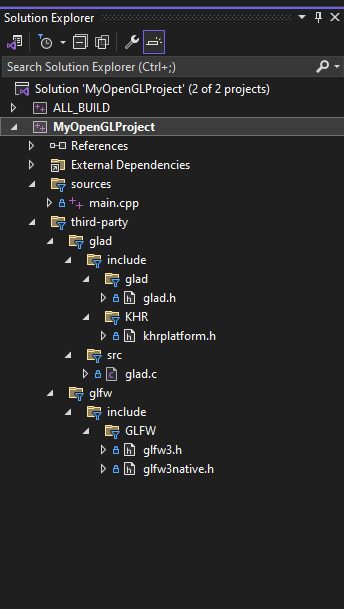

# Integrating a Third-Party Library

When developing OpenGL applications or games, you often rely on third-party libraries like glad and glfw to handle OpenGL context creation, window management, and other tasks. In this lesson, we'll explore different methods of integrating these dependencies into your project.
Let's consider the following approaches:

- Using a package manager
- Using a statically linked library
- Using sources of the libraries

## Using a package manager

One approach to managing dependencies is to use a package manager like *Conan* or *vcpkg*. These tools automate the process of resolving dependencies, downloading required packages, and handling version compatibility. By using a package manager, you avoid storing the source code of third-party libraries in your repository, which can help keep your repository size manageable and simplify dependency management.

## Statically Linked Library

If the third-party library is provided as a precompiled static library, integrating it into your project is straightforward. For example, if the library provides header files along with a static library file, you can include the header files using `include_directories()` and link against the library using `target_link_libraries()`.

```
include_directories(third-party/glfw/include)
add_executable(${PROJECT_NAME} sources/main.cpp ${GLAD_SOURCES})
target_link_libraries(${PROJECT_NAME} glfw3_mt)

```

Alternatively, if the library is provided as source code, you can compile it into a static library within your project using add_library() and then link against it.

```
add_library(glad STATIC third-party/glad/src/glad.c)
target_link_libraries(${PROJECT_NAME} glad)
```


## Providing Sources of the Libraries

Another approach is to include the source code of the third-party libraries directly in your project. This method gives you full control over the build process and allows you to customize the libraries as needed. By including the source files in your project, you can compile them alongside your own source files.

In Lesson 02, we learned how to organize source files within a project using the source_group() command. You can apply the same technique to include third-party source files in your project. For example, assuming you have the source files of a third-party library located in a directory named third-party_library, you can use source_group() to include these files in your project:

```
file(GLOB_RECURSE THIRD_PARTY_SOURCES ${CMAKE_CURRENT_SOURCE_DIR}/third-party_library/*.cpp)
source_group(TREE ${CMAKE_CURRENT_SOURCE_DIR}/third-party_library FILES ${THIRD_PARTY_SOURCES})
```


## Configuring the Example Project

Let's configure an example project to demonstrate integrating glad and glfw.

- Create a directory named third-party in your project.
- Place the dependency libraries (glad and glfw) in the third-party directory:
- Create CMakeLists.txt which generates filters for source files and link against glfw.lib

After running `cmake-generate-solution.ps1` the result will be following:


